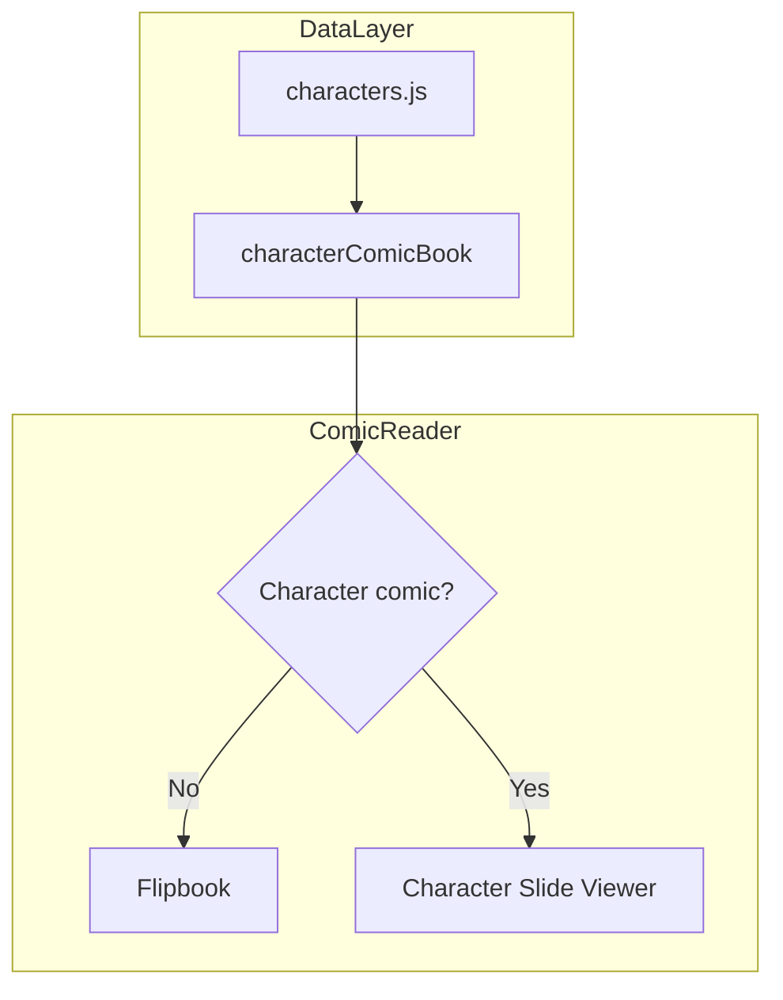

# Character Comic Book: MP4 + Narrative Integration

## Current State

- **Character comic book** ("Urban Runner: The People in My Life") is defined in [moments/moments.js](moments/moments.js) (id: `characters-comic-book-2025-09-15`) and [characters/characters.js](characters/characters.js) (`window.characterComicBook`).
- Uses the **classic flipbook** (left/right spread) with static images only.
- **Desktop**: Two characters side-by-side (left/right); **Mobile**: One character at a time.
- Character data in `characters.js` includes `pageImage`, `bio` (short), `description`, `name`, `role`, but no video field.
- **MP4 videos exist** (generated via Grok for most characters); need to be downloaded locally and placed in `/characters/` folder.
- Character bios/descriptions are currently short; will be expanded iteratively via Phase 2.

## Target UX

Maintain the **current desktop/mobile layout** but enhance with video and deeper narrative:

**Desktop**: Two characters side-by-side (left/right spreads)

- Each column is independently **vertically scrollable**
- Scroll order per character:
  1. **Static image** (character artwork)
  2. **MP4** (animated version, if available)
  3. **Narrative** (bio/description for getting to know the character)
- Navigation: Swipe/arrow keys move between *pairs* of characters (advance to next left/right pair)

**Mobile**: One character per screen

- Same three scrollable sections (image → video → narrative)
- Swipe/arrow keys move between individual characters sequentially

## Implementation Phases

### Phase 1: Viewer Build (Cursor Implementation - Immediate)

**Goals:**

- Build the character slide viewer component with Option A layout (two-up desktop, one-up mobile)
- Integrate with existing flipbook/comic system
- Add `pageVideo` fields to characters.js for videos that exist
- Use current short bios; leave structure for expansion
- Get the viewer live and functional

**Deliverables:**

- New `characterSlideViewer.js` component
- Updated `characters.js` with `pageVideo` fields and vertical scroll layout
- Updated routing to render new viewer
- Videos locally available in `/characters/` (user downloads from Grok beforehand)

**Character Data State:**

- Short bios/descriptions from current `characters.js` (Khanh has detailed profile; others use existing short versions)
- Full character development happens in Phase 2; viewer accommodates expanded content seamlessly

---

### Phase 2: Character Development (Workspace Iteration - Ongoing)

**Goals:**

- Develop detailed character profiles for each person (like Khanh example)
- Extract compelling bios/descriptions from profiles
- Iteratively enrich `characters.js` with deeper narrative

**Process:**

- Claude (me) creates detailed profiles in workspace for each character
- User reviews and updates character data in `characters.js`
- Viewer automatically displays richer content as it's added (no code changes needed)
- Can happen in parallel while Phase 1 builds

---

### Phase 3: R2 Upload (After Phase 1 Complete)

**Goals:**

- Upload MP4 files to R2 for CDN delivery
- Update `pageVideo` URLs in `characters.js` to point to R2

**Process:**

- Use existing R2 MCP to upload `/characters/*.mp4` files
- Update `pageVideo` paths from local `/characters/` to R2 URLs
- No viewer code changes; just URL updates

---

## Architecture




## Implementation Plan (Phase 1)

### 1. Extend Character Data Model

In [characters/characters.js](characters/characters.js):

- Add `pageVideo` to each character that has an MP4 available (generated via Grok):
  ```js
  pageVideo: "/characters/Paul.mp4"  // local path; will be R2 URL in Phase 3
  ```
- Keep existing `bio` and `description` fields for the narrative section (currently short; will be expanded in Phase 2)
- For characters without MP4 yet, omit `pageVideo`; the viewer will show only image + narrative
- **Note:** Video files will be downloaded from Grok and placed in `/characters/` by user before this work starts

### 2. Unify Character Comic Book Episode Data

Ensure the character comic book uses `window.characterComicBook` (from `characters.js`) when opened, so it has full character objects with `pageImage`, `pageVideo`, `bio`, etc.

- In [components/globe.js](components/globe.js): when opening `characters-comic-book-2025-09-15`, set `window.currentCharacterComicBook = window.characterComicBook` before/after setting blogPostContent.
- In [components/comicReader/core.js](components/comicReader/core.js): update `getPages` and any `postId` checks to also match `characters-comic-book-2025-09-15` so the character comic book is recognized.
- In [components/comicReader.js](components/comicReader.js): when `episodeData.id === 'characters-comic-book'`, treat it as the character comic and use the new viewer.

### 3. Create Character Slide Viewer Component

Create a new component (e.g. `components/comicReader/characterSlideViewer.js`) that maintains the current layout with enhanced scrolling:

**Desktop Layout:**

- Two characters side-by-side (left/right), mimicking the flipbook spread
- Each column is **independently vertically scrollable** with three sections per character:
  1. **Image section**: character image (`pageImage`)
  2. **Video section** (if `pageVideo` exists): `<video>` with controls
  3. **Narrative section**: character name, role, bio/description
- **Navigation**: Swiper for horizontal movement between character *pairs* (advance left/right spread)
- Reuse existing Swiper patterns from [immersiveV4.js](components/comicReader/immersiveV4.js)

**Mobile Layout:**

- Single character per screen, full width
- Same three vertically scrollable sections
- Swipe/arrows move between individual characters sequentially

**Shared Details:**

- Accepts `episodeData` with `pages` as array of character objects: `{ character, image, video?, alt, bio, description, name, role }`
- Handles missing `pageVideo` gracefully (skips video section)
- Reuses keyboard nav and back-to-cover patterns from immersiveV4
- Responsive breakpoint to switch between two-up (desktop) and one-up (mobile) layouts

### 4. Wire Character Comic to New Viewer

In [components/comicReader.js](components/comicReader.js):

- Add a check: `isCharacterComicBook = episodeData?.id === 'characters-comic-book'`.
- When `isCharacterComicBook`, render the new `CharacterSlideViewer` instead of the flipbook or immersiveV4.
- Pass `episodeData` (with `pages` from `characterComicBook.pages` mapping to full character objects) and nav callbacks (`onBackToCover`, etc.).

### 5. Build Character Pages from characterComicBook

In [characters/characters.js](characters/characters.js), `characterComicBook.pages` already maps characters to `{ number, character, image, alt }`. Extend this to include `video`, `bio`, and `description` by resolving each page's `character` id to the full character object:

```js
pages: window.characters
  .filter(c => !!c.pageImage)
  .map((c, i) => ({
    number: i + 1,
    character: c.id,
    image: c.pageImage,
    video: c.pageVideo || null,  // will be populated as videos are available
    alt: c.name,
    bio: c.bio,                  // currently short; will be expanded in Phase 2
    description: c.description,  // currently short; will be expanded in Phase 2
    name: c.name,
    role: c.role
  })),
```

**Phase 2 Note**: As character profiles are developed in the workspace (like Khanh), the corresponding `bio` and `description` fields in `characters.js` will be enriched. The viewer component requires no changes; it will automatically display the richer content.

### 6. MP4 File Placement and Naming

**Phase 1 (Now):**

- User downloads MP4s from Grok and places them in `/characters/` with naming convention: `Paul.mp4`, `Leo.mp4`, `Mom.mp4`, etc. (matching character ids)
- Add `pageVideo: "/characters/[CharName].mp4"` to `characters.js` for each character with a video
- Characters without videos omit `pageVideo`; they show image + narrative only

**Phase 3 (After Phase 1 Complete):**

- Use existing `upload_to_r2` MCP to upload `/characters/*.mp4` files to R2
- Update `pageVideo` URLs in `characters.js` to point to R2 CDN paths
- No viewer code changes; purely URL updates

### 7. Styling and UX Details

- Narrative section: readable font, sufficient contrast, padding. Consider a card-like layout.
- Video: `playsInline`, `muted` for autoplay where needed; optional tap-to-unmute.
- Ensure vertical scroll within a slide does not conflict with Swiper (e.g. use `touchReleaseOnEdges` or similar so horizontal swipes between characters still work).
- Mobile: same layout, single column, vertical scroll within each character slide.

## Files to Modify


| File                                                                                             | Changes                                                                                                             |
| ------------------------------------------------------------------------------------------------ | ------------------------------------------------------------------------------------------------------------------- |
| [characters/characters.js](characters/characters.js)                                             | Add `pageVideo` to characters; extend `characterComicBook.pages` with video, bio, description                       |
| [components/comicReader/characterSlideViewer.js](components/comicReader/characterSlideViewer.js) | **New file** – Swiper-based character slide viewer with image/video/narrative sections                              |
| [components/comicReader/render.js](components/comicReader/render.js)                             | Add `renderCharacterSlideViewer` and export it                                                                      |
| [components/comicReader.js](components/comicReader.js)                                           | Detect character comic book; render CharacterSlideViewer instead of flipbook                                        |
| [components/comicReader/core.js](components/comicReader/core.js)                                 | Recognize `characters-comic-book-2025-09-15`; ensure `getPages` returns full character page objects when applicable |
| [components/globe.js](components/globe.js)                                                       | Set `window.currentCharacterComicBook = window.characterComicBook` when opening the character comic                 |
| [index.html](index.html)                                                                         | Add script tag for `characterSlideViewer.js` (load after immersiveV4)                                               |


## Clarifications for Phase 1 Implementation

1. **Desktop/Mobile Layout**: Confirmed Option A — Two characters side-by-side on desktop (left/right, each column vertically scrollable), one character on mobile (vertically scrollable). Navigation via Swiper for pairs on desktop, individual characters on mobile.
2. **Video files**: Already generated via Grok for most characters. User will download and place in `/characters/` before Phase 1 starts.
3. **Character data**: Currently short bios/descriptions; Khanh is the full example. Phase 1 uses existing data; Phase 2 enriches iteratively.
4. **R2 Upload**: Deferred to Phase 3 (after viewer is live and working locally).

## Remaining Decisions for Cursor

1. **Video autoplay behavior**: When user scrolls to the video section, should it:
  - Auto-play (muted) with visible controls?
  - Wait for a click/play button?
  - Both (muted autoplay, but user can unmute/control)?
2. **Responsive breakpoint**: At what screen width does the layout switch from two-up (desktop) to one-up (mobile)? Suggest 768px or 1024px.
3. **Scroll interaction**: Should vertical scroll within a character column prevent horizontal swipe, or use Swiper's edge detection (e.g., `touchReleaseOnEdges: true`) to allow swipe-to-next-pair even when scrolled down?

---

## Phase 2 Workflow (Parallel - Claude in Workspace)

While Cursor builds the viewer (Phase 1), Claude will:

1. **Develop character profiles** for each person in Paul's circle (like the Khanh example)
2. **Extract narrative-driven bios and descriptions** from those profiles
3. **Provide them to Paul** for review and integration into `characters.js`
4. **Iteratively enrich** the character viewer's content without requiring code changes

The viewer is built to seamlessly accommodate deeper, longer character narratives as they're added. No implementation changes needed—just data updates.

---

## Success Criteria for Phase 1

- ✅ Character slide viewer built and renders correctly (desktop two-up, mobile one-up)
- ✅ Vertical scrolling within each character column works smoothly
- ✅ Horizontal navigation (Swiper) between character pairs/individuals works
- ✅ Videos render and play (local `/characters/` paths)
- ✅ Characters without videos gracefully skip video section
- ✅ Responsive breakpoint switches layout appropriately
- ✅ Back-to-cover and keyboard navigation work
- ✅ Data structure ready for Phase 2 content expansion

