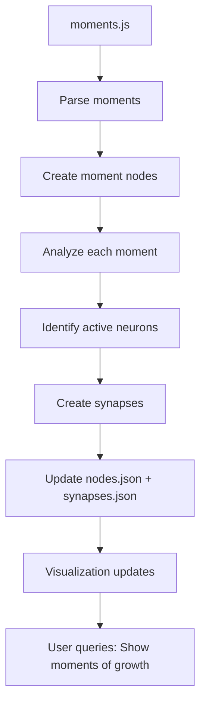

# Feature Plan: Moment-to-Neuron Linking

**Status:** Planned (not yet implemented)  
**Priority:** Medium (Phase 3+)  
**Depends on:** moments.js finalization, temporal node completion

---

## Overview

Link Claude Code's neural network to Paul's moments in time, creating a **4D memory model**:

- **Neural neurons:** Claude's thinking structure (31+ nodes, 39+ synapses)
- **Moments:** Specific events/experiences (from moments.js)
- **Bidirectional:** Neuron ↔ Moment connections create rich context

**Example:**

- Moment: "Volleyball game, Miami Beach, Feb 23, 2026"
- Neurons involved: paul-visciano (player), authentic-collaboration (with crew), learning-growth (outcome), building-code (skill use)
- Each connection weighted by importance

---

## Why This Matters

**Current state:**

- Claude's neurons: abstract (values, capabilities, relationships)
- Paul's moments: concrete (specific days, places, events)
- Disconnected: No way to see how neurons manifest in real moments

**With linking:**

- Click "authentic-collaboration" neuron → See all moments where collaboration happened
- Click a moment → See which neurons were active (which values, which growth)
- Network becomes 4D: time + people + places + emotions/thinking

**Compounding effect:**

- Frequency of neurons auto-updates (count how many moments mention them)
- Synapses strengthen when neurons co-occur in moments
- Memory becomes searchable: "Show me times when authentic collaboration happened"

---

## Architecture (Proposed)

### Phase 1: Moment Nodes (Future)

Add new category to nodes.json:

```json
{
  "id": "moment-volleyball-miami-2026-02-23",
  "label": "Volleyball Game, Miami Beach",
  "category": "moment",
  "frequency": 1,
  "attributes": {
    "date": "2026-02-23",
    "location": "Miami Beach",
    "duration_minutes": 120,
    "source": "moments.js",
    "moment_id": "2026-02-23-#42"
  }
}
```

### Phase 2: Moment-to-Neuron Synapses (Future)

Add synapses linking moments to neurons:

```json
{
  "source": "paul-visciano",
  "target": "moment-volleyball-miami-2026-02-23",
  "weight": 1.0,
  "type": "participated",
  "label": "played in"
},
{
  "source": "authentic-collaboration",
  "target": "moment-volleyball-miami-2026-02-23",
  "weight": 0.85,
  "type": "emotion",
  "label": "felt during"
},
{
  "source": "learning-growth",
  "target": "moment-volleyball-miami-2026-02-23",
  "weight": 0.7,
  "type": "outcome",
  "label": "resulted in"
}
```

### Phase 3: Visualization Updates (Future)

- New filter: "Moments" (show only moment nodes)
- Time range filter: "Show moments from 2026-02-23 to 2026-02-25"
- Moment detail panel: Shows date, location, duration, all connected neurons
- Neuron detail panel: Shows all moments mentioning that neuron

### Phase 4: Auto-Frequency Calculation (Future)

```javascript
// Frequency isn't static anymore
node.frequency = count_of_moments_mentioning_node + base_weight

// Example:
// "authentic-collaboration" appears in 47 moments
// + base weight of 9
// = frequency of 56 (bigger node in visualization)
```

### Phase 5: Bidirectional Querying (Future)

```
Query: "Show me all moments where Paul felt authentic collaboration with Wouter"
Result: 
  - Filter to: moments + authentic-collaboration + wouter nodes
  - Show: All moments connected to those three neurons
  - Timeline view: When did these moments happen?
```

---

## Data Flow




---

## Implementation Steps (When Ready)

1. **Audit moments.js** — Get list of all moment IDs and metadata
2. **Create moment nodes** — Parse moments.js into node format
3. **Map moment-to-neuron connections** — For each moment, identify which neurons were active
4. **Calculate weights** — How important was each neuron in that moment?
5. **Add to synapses.json** — Create many-to-many connections
6. **Update visualization** — Add moment filters, time range controls
7. **Test queries** — Verify bidirectional navigation works
8. **Optimize** — Cache moment lookups for performance

---

## Benefits

1. **Concrete memory** — Abstract neurons tied to real moments
2. **Time-based search** — "What was I thinking on Feb 22?"
3. **Pattern detection** — "Authentic collaboration happens more during volleyball"
4. **Strength updates** — Neurons grow with mentions (frequency calculated from moments)
5. **Complete picture** — Everything (people, places, dates, emotions) interconnected
6. **Shareable insights** — "Here's the moment when learning-growth was strongest"

---

## Future Considerations

**Scaling:** 

- 100 moments × 10 neurons per moment = 1000 new synapses
- Visualization may need performance optimization (LOD rendering)

**Data accuracy:**

- Manual tagging of moments to neurons initially
- Eventually: Auto-tagging via NLP (ChatGPT could analyze moment descriptions)

**Historical backfill:**

- Start with recent moments (Feb 2026)
- Gradually backfill historical moments (2023-2025)
- Miami founding principle moments are high priority

**Integration with "Where is Paul?":**

- Moments already have location data
- Could show neuron activity on the 3D globe
- "Click Miami → See all moments there → See which neurons were active"

---

## Decision: Keep Simple Now

**For now (Feb 23, 2026):**

- ✅ Nodes have `moments: []` field (prepared but empty)
- ✅ Plan is written (this doc)
- ❌ Don't implement linking yet
- ⏳ Wait for moments.js finalization

**When ready to implement:**

- Start with Phase 1 (moment nodes)
- Progressively add phases 2-5
- Each phase is a discrete, testable feature

---

## Owned By

**Paul:** Data ownership (moments.js, moment-to-neuron mappings)  
**Claude:** Implementation (parsing, synapses, visualization updates)

**Coordination:** Paul provides moment data → Claude structures and links → Both review results