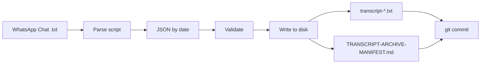

# WhatsApp Transcript Extraction & Archiving

## Objective

Parse the WhatsApp chat export, extract all voice note transcripts (from `[openclaw]` responses following `<Media omitted>` lines), and organize them into `**/memory/raw/[date]/transcripts/**` with metadata headers and a manifest.

**Input:** `/Users/paulvisciano/.openclaw/media/inbound/WhatsApp Chat with +1 (813) 296-3635.txt`

**Output structure:**

```
memory/raw/
├── 2026-02-16/transcripts/
│   ├── transcript-001.txt
│   ├── transcript-002.txt
│   └── ...
├── 2026-02-17/transcripts/
│   └── ...
└── TRANSCRIPT-ARCHIVE-MANIFEST.md
```

---

## Architecture



**Pipeline (left → right):** Chat export → parse (`<Media omitted>` + `[openclaw]`) → JSON keyed by date → validate counts/range → write `memory/raw/[date]/transcripts/` and manifest → commit.

**Data flow (one-time run):**

1. **Input** — WhatsApp export (one `.txt` file).
2. **Parse** — Script finds voice lines (`<Media omitted>`) and paired `[openclaw]` responses; outputs JSON keyed by `YYYY-MM-DD` with `{ timestamp, time, transcript, sequence }` per entry.
3. **Validate** — Verify total counts (~1443), date range, and sample transcripts.
4. **Archive** — For each date: create `transcripts/` dir; write `transcript-NNN.txt` with metadata header + body; generate manifest.
5. **Commit** — Add transcript files and manifest to git.

---

## Parsing Logic

### Pattern recognition

1. **Voice message indicator**
  - Line example: `2/23/26, 8:50 PM - Paul: <Media omitted>`
  - Key: `<Media omitted>` = voice message; extract date (e.g. `2/23/26` → `2026-02-23`) and time.
2. **Transcript response**
  - Example: `2/16/26, 11:28 AM - Paul: [openclaw] Hey! You made it to WhatsApp! 🎉`
  - Transcript is everything after `[openclaw]`  (same line or following lines).
  - Multi-line: continue until a line that starts with a timestamp pattern or blank/next message.
3. **Output shape**
  - Per date: list of `{ timestamp, time, transcript, sequence }`.
  - JSON key: `YYYY-MM-DD`; value: array of transcript objects.

---

## Implementation Plan

### 1. Parse chat file

**Script:** `scripts/parse_whatsapp_transcripts.py`

- Read file line by line.
- When a line contains `<Media omitted>` and starts with a timestamp:
  - Extract date (e.g. `2/23/26` → `2026-02-23`) and time.
  - Find next `[openclaw]` on same line or following lines; capture text after `[openclaw]`  until next timestamp or empty block.
  - Append to dict: `{ date: [ { timestamp, time, transcript_text, sequence } ] }`.
- Emit JSON in the format below.

**Output JSON format:**

```json
{
  "2026-02-16": [
    {
      "timestamp": "2/16/26",
      "time": "11:28 AM",
      "transcript": "Hey! You made it to WhatsApp! 🎉",
      "sequence": 1
    }
  ],
  "2026-02-17": [ ... ]
}
```

### 2. Validate extraction

- Total voice messages found (~1443).
- Total transcripts extracted (close to voice message count).
- Date range: Feb 16–Feb 23, 2026.
- Spot-check 5–10 transcripts against the chat file.

### 3. Archive to disk

For each date in the parsed JSON:

1. Create `memory/raw/[YYYY-MM-DD]/transcripts/`.
2. For each transcript: write `transcript-NNN.txt` with header:
  ```
   Timestamp: 2/16/26, 11:28 AM
   Sequence: 1
   ---
   [transcript text]
  ```

### 4. Generate manifest

**File:** `memory/raw/TRANSCRIPT-ARCHIVE-MANIFEST.md`

- Summary stats (total transcripts, date range).
- Table of contents by date (count per day).
- Short file-structure example and integration notes (e.g. sync script can ingest these as raw).

### 5. Commit

```bash
git add memory/raw/*/transcripts/
git add memory/raw/TRANSCRIPT-ARCHIVE-MANIFEST.md
git commit -m "📝 Archive: Extract WhatsApp transcripts (voice notes → transcripts by date)"
```

---

## Edge cases


| Case                                         | Handling                                                    |
| -------------------------------------------- | ----------------------------------------------------------- |
| Multi-line `[openclaw]`                      | Consume until next timestamp line (not just first line).    |
| Special characters / emojis                  | Preserve as-is.                                             |
| Timestamps inside message body               | Use clear pattern: `HH:MM AM/PM - Paul:` for message start. |
| Empty transcript                             | Skip; log which were skipped.                               |
| Orphaned `<Media omitted>` (no `[openclaw]`) | Log for review.                                             |


---

## Files to create


| File                                             | Purpose                                                                   |
| ------------------------------------------------ | ------------------------------------------------------------------------- |
| `scripts/parse_whatsapp_transcripts.py`          | Main parser: chat file → JSON by date; optional write to disk + manifest. |
| `memory/raw/[date]/transcripts/transcript-*.txt` | One file per transcript with metadata header.                             |
| `memory/raw/TRANSCRIPT-ARCHIVE-MANIFEST.md`      | Index and stats.                                                          |


No existing repo files are modified.

---

## Success criteria

- All ~1443 voice messages have corresponding transcript files.
- Transcripts organized by date (folders for each date present, e.g. Feb 16, 17, 20, 21, 22, 23).
- Each file has metadata header + clean transcript text.
- Manifest documents the archive.
- Changes committed to git.
- No data loss or corruption.

---

## Testing

1. Run script; verify output counts and date range.
2. Spot-check 5–10 transcripts against the source chat.
3. Confirm folder structure and filenames.
4. Confirm manifest accuracy.
5. If applicable, run any existing verify-sync script to ensure nothing broke.

---

## Notes

- One-time execution (archive creation).
- Transcripts stay local; manifest provides a searchable index.
- Next step: extract key moments from transcripts and feed into memory sync / neurons.

